# ExoLife: Rapport des missions

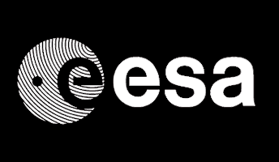

---

# Objectif

Rechercher de la vie ailleur dans l'univers grâce au traitement d'images

---

## Sommaire

- Missions A: traitement d'image local
- Missions B: transformation linéaire et seuillage
- Missions U: traitement par convolution et détection de contour
- Missions X: transformation de Fourrier et filtre median

---

## Mission A-1: Encelade

Identifier une zone ou atterir.

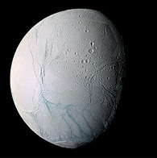

+++

## Image originale

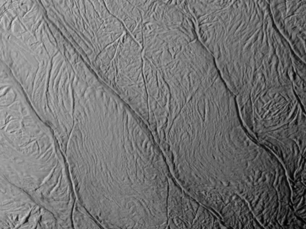

+++

## Resultat

On cherche le pixel qui a la valeur la plus élevée.

Valeur du pixel: 216

Coordonnées: x=22;y=38

---

## Mission A-2: Mars

Déterminer la quantité de certains gaz (méthane par exemple) dans l’atmosphère martienne (indice de vie potentielle).

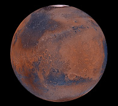

+++

## Image originale

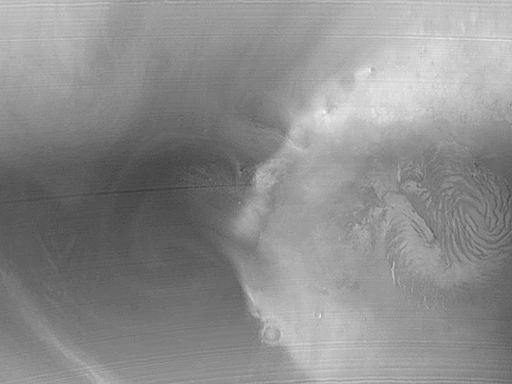

+++

## Resultat

On fait une moyenne de la valeur des pixels et on la convertie en pourcentage.

Taux de gaz: 54.93 %

---

## Mission A-3: Europe

Cartographier la circulation de l'eau sous la surface glacée de l'astre en ne faisant apparaître que les canaux d'eau "chaude".

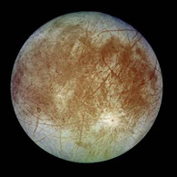

+++

## Image originale

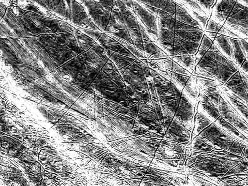

+++

## Etape 1

On applique un seuillage pour garder uniquement les pixels blancs.


+++

## Resultat

On applique un filtre passe bas.

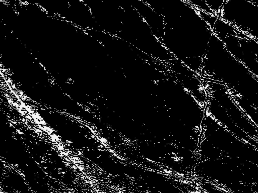

---

## Mission A-4: Jupiter

Obtenir une image de la planète de meilleure qualité.


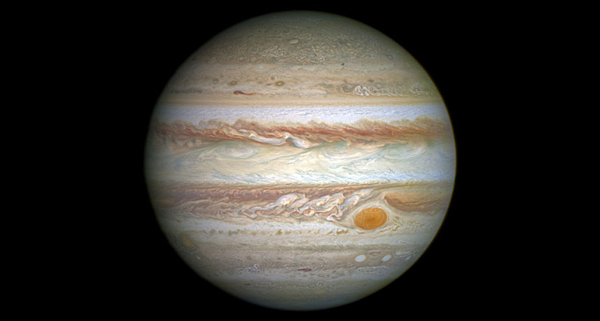

+++

## Image originale 1

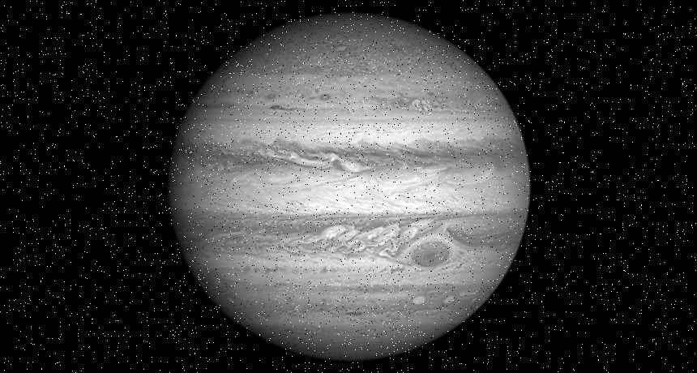 

+++

## Image originale 2

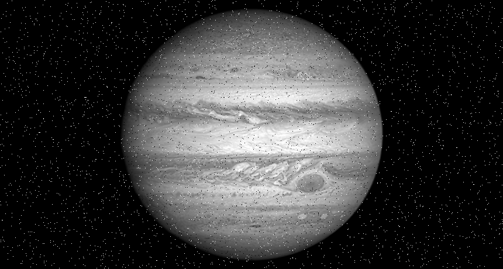

+++

## Soustration d'image
```
// Definir une image bruit
img3 = soustraction(img2, img1);
imwrite(to_native_img(img3), "img/step1.png");

// Soustraire le bruit
img4 = soustraction(img1, img3);
imwrite(to_native_img(img4), "img/step2.png");

// Appliquer un filtre median
result = median(img4, 25);
imwrite(to_native_img(result), "img/result.png");
```
@[2-3]
@[6-7]
@[10-11]

+++

## Resultat

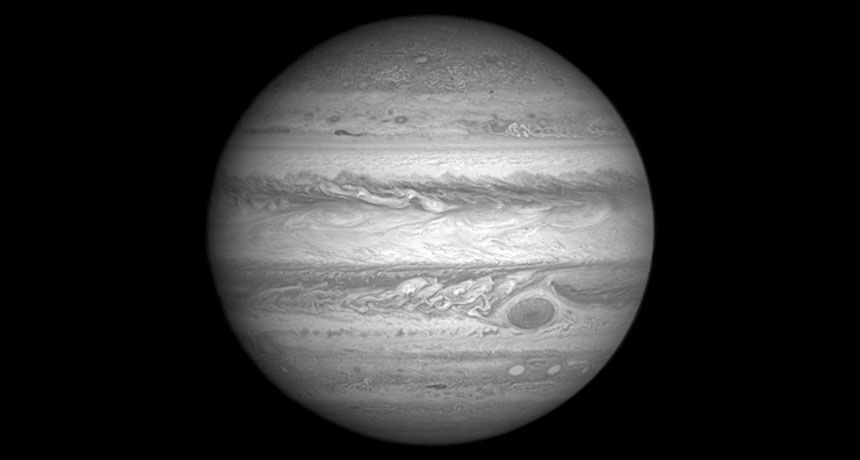
---
## Mission B-1: Gliese 667Cc

Travailler l'image reçue afin de faire apparaître l'atmosphère de la planète.


+++

## Image originale

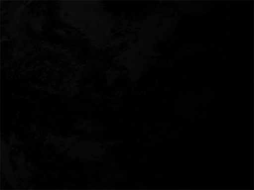

+++

## Transformation linéaire

```
getd ('../../libs/');
source = readpbm('Gliese 667Cc_surface.pbm');

// Transformation linéaire
result = 255 / (max(source) - min(source)) * (source - min(source));

// Export to png
imwrite(to_native_img(result), "img/result.png");
```

@[1-2]
@[5]
@[8]

+++

## Resultat

On fait une transformation linéaire.

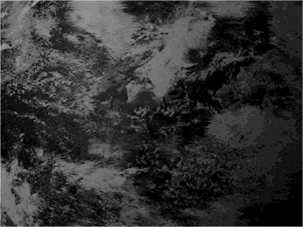

---

## Mission B-2: GD 61

Améliorer la visibilité de l'image pour la donner ensuite à un autre service qui identifiera la position de GD 61.

+++

## Image originale


+++

## Resultat

On fait une transformation linéaire.


---

## Mission B-3: HD 215497 b

Séparer en 4 parties distinctes les zones présentes sur la photo afin de distinguer les zones plus ou moins chaudes (terre, volcans, eau, etc.).

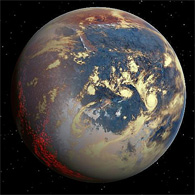

+++

## Image originale

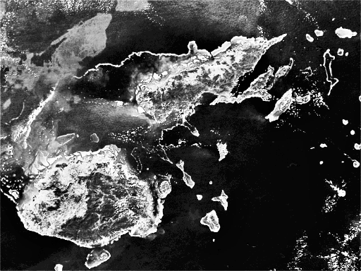

+++

## Etape 1: Génerer l'histogramme

```
img = readpbm('HD215497.pbm');
xmax = size(img,1);
ymax = size(img,2);
hist = zeros(1,256);

for x=1:xmax
    for y=1:ymax
        hist(double(img(x,y))+1)=hist(double(img(x,y))+1)+1;
    end
end
```

@[1-4]
@[6-10]

+++

## Etape 1: Génerer l'histogramme

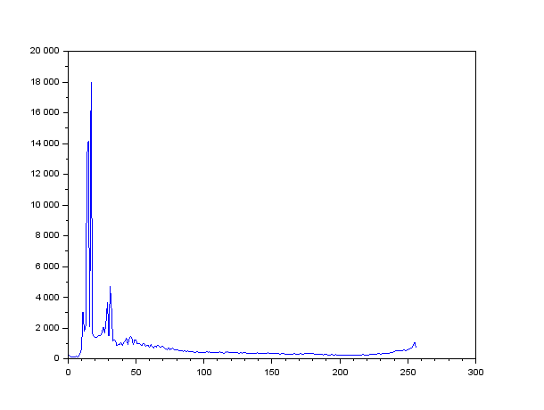

+++

## Etape 2: Effectuer 4 seuillages

```
function [render]=seuillage(img,seuil)
    xmax = size(img,1)
    ymax = size(img,2)
    colorMin = 0
    for x=1:xmax
        for y=1:ymax
            if (img(x,y) < seuil) then
                img(x,y) = colorMin;
            else
                img(x,y) = seuil;
            end
        end
    end
    render = img;
endfunction
```

@[1]
@[2-4]
@[5-13]

+++

## Resultat: 10

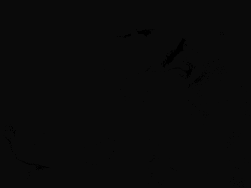

+++

## Resultat: 16

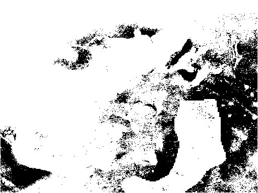

+++

## Resultat: 31

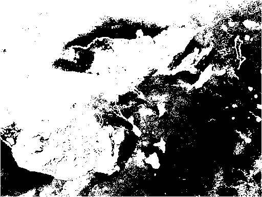

+++

## Resultat: 255

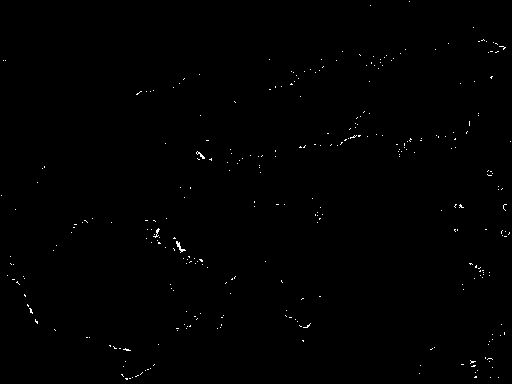

---

## Mission U-1: Planete inconnue

Une image a été interceptée par une sonde. L'analyse à faire doit permettre de faire apparaître ce qui ressemble à un "réseau routier".

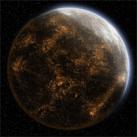

+++

## Image originale

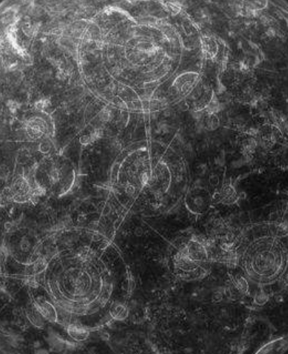

+++

## Etape 1: Filtre passe haut

```
filtre_passe_haut = [
    0 -2 0
    -2 9 -2
    0 -2 0
];

imgF = imfilter(img, filtre_passe_haut);
```

+++

## Resultat

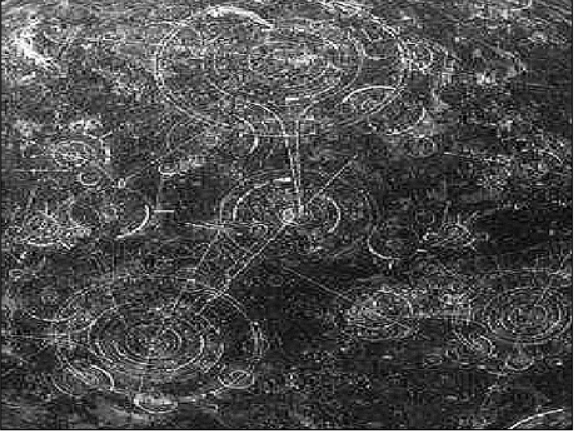

---

## Mission U-2: Inconnu

Une planète semble se trouver à un endroit de l'univers où une faille temporelle a été détectée (un trou noir était à l'origine supposé). Un corps étranger semble perturber les analyses, il faut donc l'isoler sur l'image, car cela pourrait signifier la présence d'une technologie avancée.

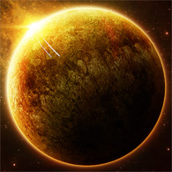

+++

## Image originale

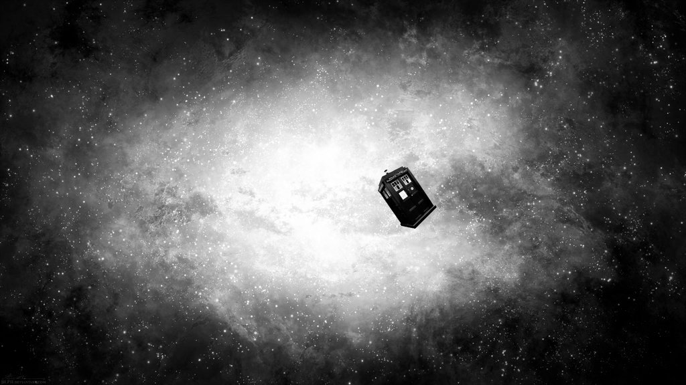

+++

## Resultat

On applique une détéction de contours de type sobel.


---

## Mission X-1: Asellus Secundus

Transformer l'étrange image reçue par la sonde. Celle-ci ne répond plus aux communications depuis que l'image a été envoyée.

+++

## Image originale

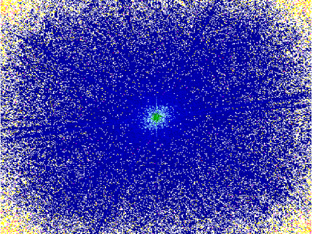

+++

## Resultat

On fait une transformation inverse de Fourrier.

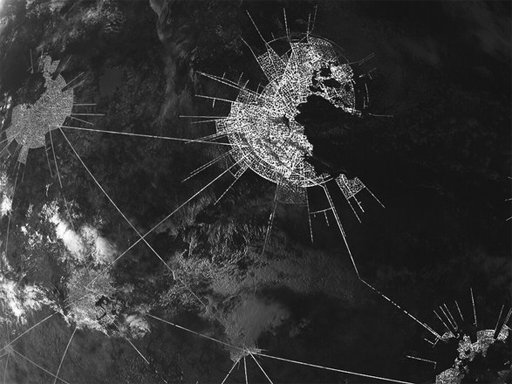

---

## Mission X-2: Gliese 581d

Vérifier que ce qui apparaît sur l'image est bien de la végétation.

+++

## Image originale

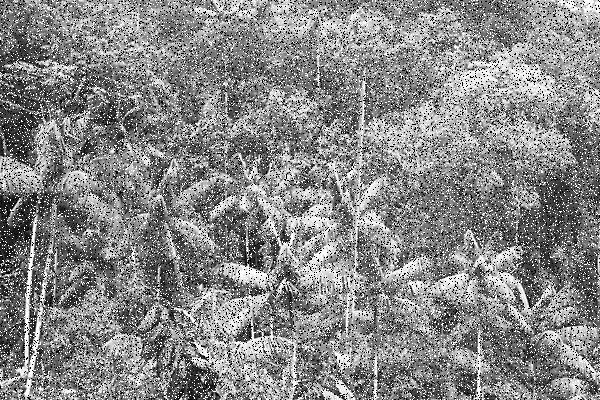

+++

## Resultat

On applique un filtre median.

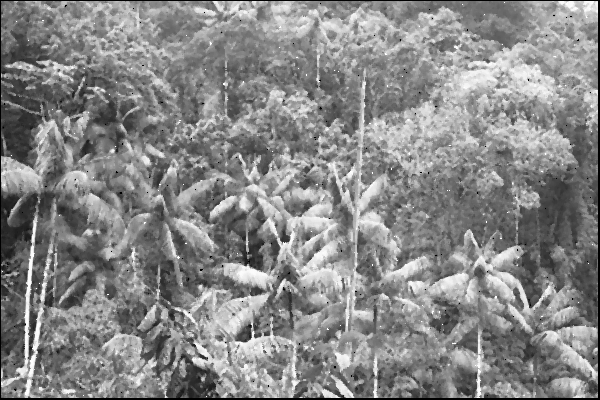

---

## Conclusion

- Traitement d'image 👍️
- Faire un mini framework ?
- Scilab 🎲
- Scilab documentation 👎