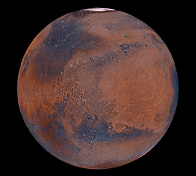

# Mission A-2

## Presentation

### Mars

Quatrième planète du système solaire.
Aurait abrité de la vie autrefois.

#### Objectif 

Déterminer la quantité de certains gaz (méthane par exemple) dans l’atmosphère martienne (indice de vie potentielle).
> L'image satellite fournie met en avant des nuages de ce qui semblerait être du méthane. En considérant qu'un pixel contenant du gaz à 100% sera blanc et un pixel n'en contenant pas sera noir, un pixel gris en contiendra un pourcentage proportionnelle à son niveau. Evaluez le taux de gaz dans l'image.

## Solution

### Original

### Resultat