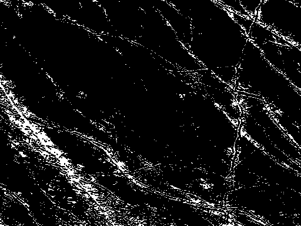

# Mission A-3

## Presentation

### Europe

Satellite de Jupiter.
Pourrait abriter la vie dans l'eau présente sous son océan subglaciaire.

#### Objectif 

Cartographier la circulation de l'eau sous la surface glacée de l'astre en ne faisant apparaître que les canaux d'eau "chaude".
> L'image satellite infra-rouge fournie met en avant des réseaux d'eau plus chaude que la surface.  

## Solution

### Original

### Resultat

#### Etape 1: Garder uniquement les pixels blancs

#### Etape 2: Filtre passe bas

