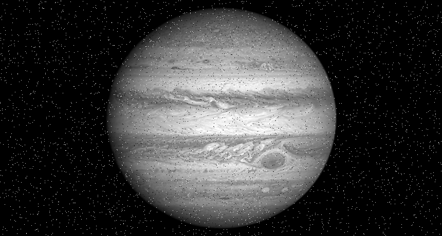
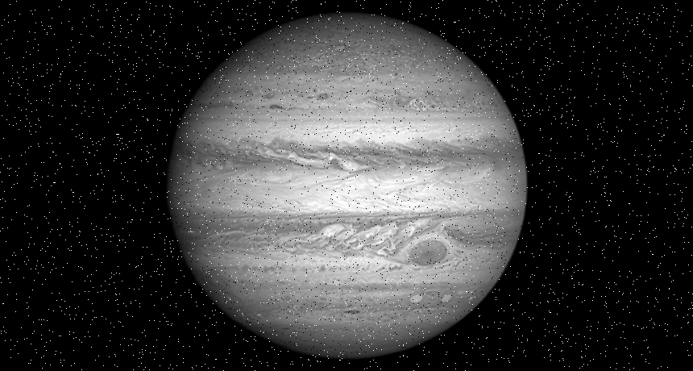

# Mission A-4

## Presentation

### Jupiter

Géante Gazeuse de notre système solaire.
Pourrait héberger une atmosphére d'eau et de glace.

#### Objectif 

Obtenir une image de la planète de meilleure qualité.
> Deux photographies faites à quelques secondes d'intervalle. Il y a eu des erreurs dans la transmission des photos par le satellite. 

## Solution

### Original

### Resultat