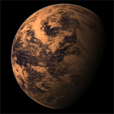
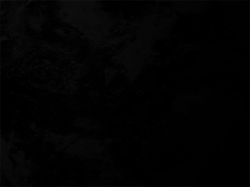

# Mission B-1

## Presentation

### Gliese 667Cc

Planète extrasolaire de type Super-Terre.
Membre du système de trois étoiles Gliese 667 situé à 22,7 années-lumière, dans la constellation du Scorpion.
Présente des similarités avec la Terre.

#### Objectif 

Travailler l'image reçue afin de faire apparaître l'atmosphère de la planète.
> Cette planète se trouvant à une très grande distance de notre système solaire, les sondes nucléaires envoyées n'ont pu récupérer que quelques images de mauvaise qualité.

## Solution

### Original

### Resultat