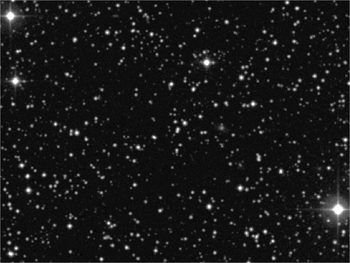

# Mission B-2

## Presentation

### GD 61

Naine blanche située à environ 150 années-lumière de la Terre.
Son système planétaire possèderait un astéroïde qui contiendrait de l'eau.

#### Objectif 

Améliorer la visibilité de l'image pour la donner ensuite à un autre service qui identifiera la position de GD 61.
> Une image de la zone où se trouve GD 61.

## Solution

### Original

### Resultat

#### Etape 1: Transformation linéaire

