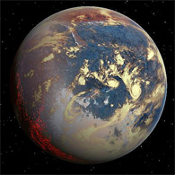
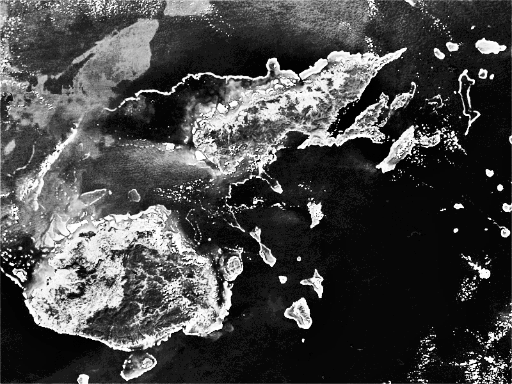
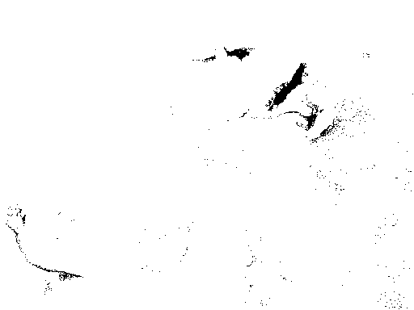
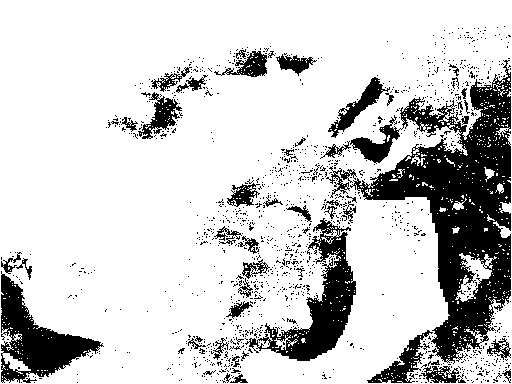
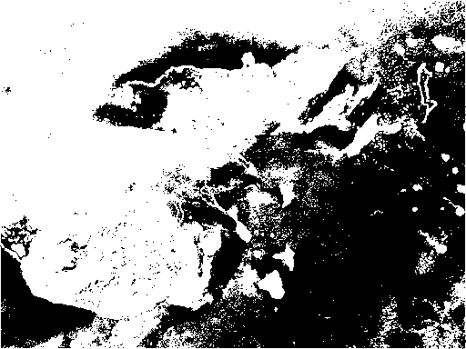

# Mission B-3

## Presentation

### HD 215497 b

Super-Terre "chaude" située dans la constellation  du Toucan (température d'environ 96°C).
Tourne autour d'une étoile très similaire au soleil (type K3V).

#### Objectif 

Séparer en 4 parties distinctes les zones présentes sur la photo afin de distinguer les zones plus ou moins chaudes (terre, volcans, eau, etc.).
> Une sonde à fusion nucléaire a permis de prendre un cliché exceptionnel de la surface de la planète.

## Solution

### Original

### Resultat

#### Etape 1: Calcul de l'histogramme

#### Etape 2: Affichage des différents seuillages

