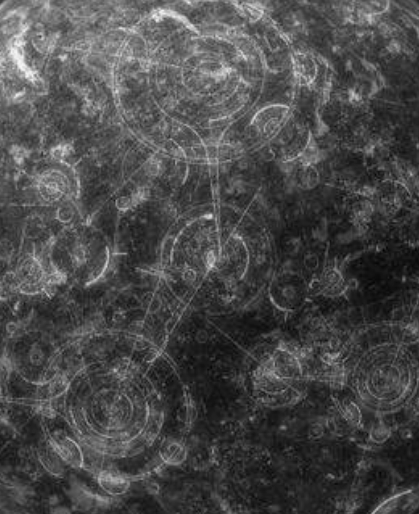

# Mission U-1

## Presentation

### Planete inconnue

Système solaire inconnu.
Planète inconnue.

#### Objectif 

Une image a été interceptée par une sonde. L'analyse à faire doit permettre de faire apparaître ce qui ressemble à un "réseau routier".
> Une image sur laquelle les contours ne sont pas clairement identifiés: il faut améliorer cet aspect de l'image.

## Solution

### Original

### Resultat

