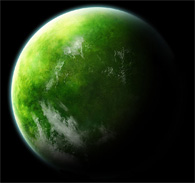
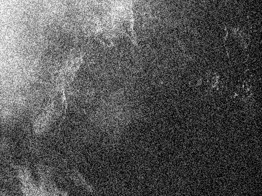

# Mission X-2

## Presentation

### Gliese 581d

Gliese 581 est une étoile naine rouge située dans la constellation de la Balance.
La planète Gliese 581d se trouve dans la zone habitable, et pourrait être une planète habritant de la végétation.

#### Objectif 

Vérifier que ce qui apparaît sur l'image est bien de la végétation.
> L'image envoyée par la sonde a été fortement altérée et contient beaucoup de bruit. Il faut débruiter l'image pour que la mission soit un succès.

## Solution

### Original

### Resultat

#### Etape 1: Effectuer une moyenne des niveaux de gris

Taux de gaz (%): 54.926574